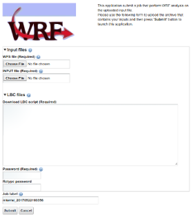

WRF Portlet
===

## How to use it

###### **Damas Makweba**, DIT - Dar es Salaam Institute of Technology - ( [@dmakweba](https://github.com/dmakweba) )
###### **Mario Torrisi**, DFA-UNICT - Physics and Astronomy Department, University of Catania - ( [@mtorrisi](https://github.com/mtorrisi) )

---

## WRF user interface

---

## Run analysis

1. Select the **namelist.wps** using the '*Choose File*' button.
1. Select the **namelist.input** using the '*Choose File*' button.
1. Create the script to download the Lateral Boundary Condition (**LBC**) files for your analysis, from [https://rda.ucar.edu/](https://rda.ucar.edu/) repository
> NB You need a registered account on [https://rda.ucar.edu/](https://rda.ucar.edu/) to proceed.
1. Fill the password fields with your [https://rda.ucar.edu/](https://rda.ucar.edu/) password.
1. Press  and ...  Your analysis will perform on a remote site. 

---?gist=29a1e75e40c7bae7d6114214dfab06b9

An example of *WPS* file of Italy.

---?gist=a7c11a812b5294e011977cd290818de0

An example of *INPUT* file.

---?gist=380ea4af805494fc85dc668dff46ec12

> NB Please, replace `<your@email.here>` with your own.

---

## Demo

---

### Thank you!
#### [www.sci-gaia.eu](http://www.sci-gaia.eu)
